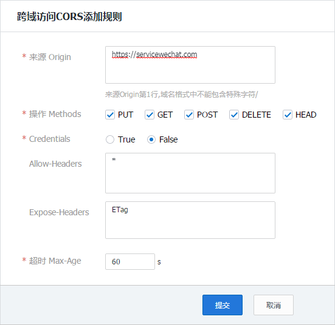

# cos-wx-sdk-v4

微信小程序 sdk for [腾讯云对象存储服务](https://www.qcloud.com/product/cos)

## 前期准备

1. 请您到 https://console.qcloud.com/cos 获取您的项目 ID(appid)，bucket，secret_id 和 secret_key。
3. 请您到 https://console.qcloud.com/cos 针对您要操作的 bucket 进行跨域（CORS）设置，可以按照如下范例，修改来源 Origin：
                                                                 
    

## 配置

### Step1. 下载源码
从 [github](https://github.com/tencentyun/cos-wx-sdk-v4/archive/master.zip) 下载源码，将 SDK 中 dist 目录下的 [cos-wx-sdk-v4.js](https://github.com/tencentyun/cos-wx-sdk-v4/blob/master/dist/cos-wx-sdk-v4.js) 包含到您的项目中。

### Step.2 加载文件

把 cos-wx-sdk-v4.js 放在小程序 app/lib/ 目录下，在您的页面 js 里引入：

```js
require('../../lib/cos-wx-sdk-v4');
```

## 使用

### cos-wx-sdk-v4 与 cos-js-sdk-v4 的不同点

1. 小程序文件上传过程中，js 没权限读取文件内容，所以 wx-sdk 相比 js-sdk 少了分片上传的所有逻辑。
2. 由于文件不分片上传只支持 20MB 大小，wx-sdk 上传接口最大只支持 20MB 大小的文件上传。
3. 小程序里发送请求使用微信提供的 api `wx.request` 和 `wx.uploadFile`。

### 示例代码

所有的示例代码实现可以参考 samples/simple-app/pages/index/index.js

### 初始化

```js
//初始化逻辑
//特别注意: WX-SDK 使用之前请先到 https://console.qcloud.com/cos 对相应的Bucket进行跨域设置
var cos = new CosCloud({
    appid: appid, // APPID 必填参数
    bucket: bucket, // bucketName 必填参数
    region: 'sh', // 地域信息 必填参数 华南地区填 gz 华东填 sh 华北填 tj
    getAppSign: function (callback) {//获取签名 必填参数

        // 下面简单讲一下获取签名的几种办法
        // 首先，签名的算法具体查看文档：[COS V4 API 签名算法](https://www.qcloud.com/document/product/436/6054)

        // 1.搭建一个鉴权服务器，自己构造请求参数获取签名，推荐实际线上业务使用，优点是安全性好，不会暴露自己的私钥
        // 拿到签名之后记得调用callback
        /*
        wx.request({
            url: 'SIGN_URL',
            data: {once: false},
            dataType: 'text',
            success: function (result) {
                var sig = result.data;
                callback(sig);
            }
        });
        */

        // 2.直接在浏览器前端计算签名，需要获取自己的 accessKey 和 secretKey, 一般在调试阶段使用
        // 拿到签名之后记得调用 callback
        // var res = getAuth(false); // 这个函数自己根据签名算法实现
        // callback(res);

        // 3.直接复用别人算好的签名字符串, 一般在调试阶段使用
        // 拿到签名之后记得调用 callback
        // callback('YOUR_SIGN_STR')

    },
    getAppSignOnce: function (callback) { //单次签名，必填参数，参考上面的注释即可
        // 填上获取单次签名的逻辑
        // var res = getAuth(true); // 这个函数自己根据签名算法实现
        // callback(res);
    }
});
```

## 接口调用示例

以下示例代码需要前置定义部分变量
```js
var bucket = 'WXAPP_BUCKET_NAME';
var successCallback = function (result) {
    console.log('success', result);
}
var errorCallback = function (result) {
    console.log('success', result);
}
var progressCallback = function (info) {
    console.log('success', result);
}
```

### 上传程序示例

```js
wx.chooseImage({
    count: 1,
    sizeType: ['original', 'compressed'],
    sourceType: ['album', 'camera'],
    success: function (res) {
        if (res.tempFilePaths && res.tempFilePaths.length) {
            var tempFilePath = res.tempFilePaths[0];
            wx.showToast({title: '正在上传...', icon: 'loading', duration: 60000});
            cos.uploadFile({
                success: successCallback,
                error: errorCallback,
                onProgress: progressCallback, // 返回 info 对象，带有 loaded、total、percent、speed 四个字段
                bucket: 'wx',
                path: '/test.png',
                filepath: tempFilePath,
                insertOnly: 0, // insertOnly==0 表示允许覆盖文件 1表示不允许覆盖
                bizAttr: 'test-biz-val'
            });
        }
    }
});
```

### 创建文件夹示例

```js
cos.createFolder(successCallback, errorCallback, bucket, '/test', 'folder_first_attr');
```

### 获取文件夹内列表示例

```js
cos.getFolderList(successCallback, errorCallback, bucket, '/test');
```

### 查询文件夹属性示例

```js
cos.getFolderStat(successCallback, errorCallback, bucket, '/test');
```

### 更新文件夹属性示例

```js
cos.updateFolder(successCallback, errorCallback, bucket, '/test', 'folder_new_attr');
```

### 删除文件夹示例

```js
cos.deleteFolder(successCallback, errorCallback, bucket, '/test');
```

### 删除文件示例
```js
cos.deleteFile(successCallback, errorCallback, bucket, '/test.png');
```

### 获取文件属性示例

```js
cos.getFileStat(successCallback, errorCallback, bucket, '/test.png');
```

### 更新文件属性示例

```js
cos.updateFile(successCallback, errorCallback, bucket, '/test.png', 'file_new_attr');
```

### 拷贝文件示例

```js
cos.copyFile(successCallback, errorCallback, bucket, '/test.png', '/test-cp.png', 0);
```

### 移动文件示例

```js
cos.copyFile(successCallback, errorCallback, bucket, '/test.png', '/test-cp.png', 0);
```


## 反馈

欢迎提 [issue](https://github.com/tencentyun/cos-wx-sdk-v4/issues)
